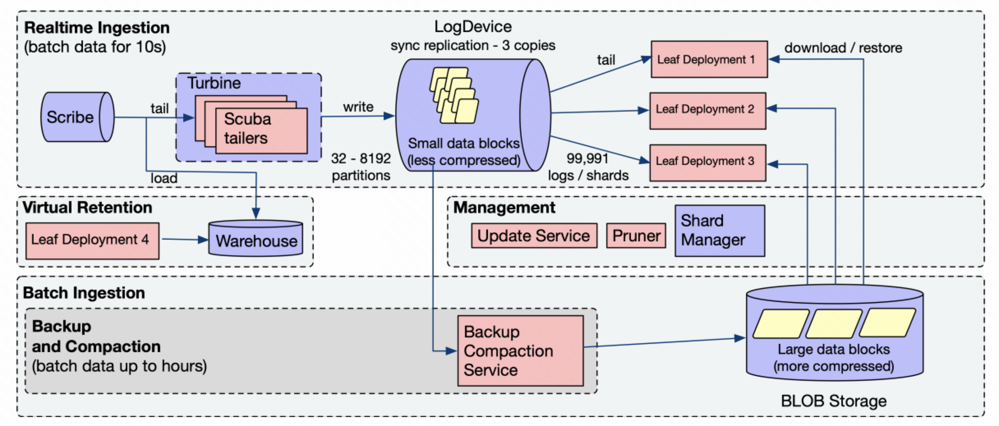
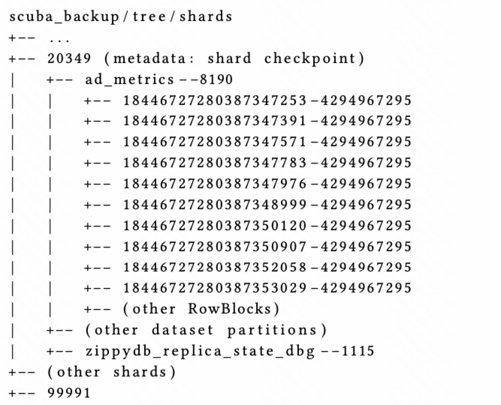
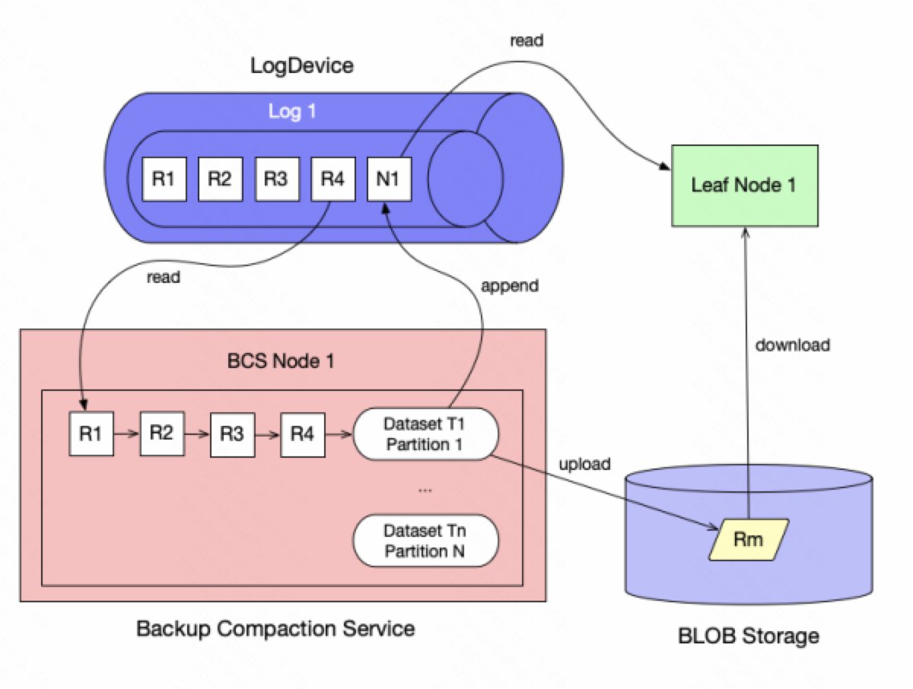

Kraken [1] 是Meta用于取代Scuba的下一代监控分析平台，用于解决Scuba在一致性和可靠性等方面的问题。Kraken一个独特的设计在于使用消息中间件来存储所有的元数据变更，避免分布式环境下进行并发控制的困难。

## 系统架构

## 数据存储

Kraken主要的数据存储在BLOB上。BLOB是一个类似于Amazon S3的一个分布式对象存储系统。

Kraken中每个数据集会被划分成多个分区。每个数据集的分区数在初始化时为32。之后随着数据的增长，分区数会逐渐增长到最多8192。Kraken的数据分区会进一步被划分到一组shard中。每个分区都唯一对应一个shard。在存储和查询时，Kraken都会以shard为单位进行分配。

Kraken在BLOB上的存储结构如下所示

Kraken数据的根目录为`scuba_backup/tree`。在这个目录下包含了一组shard目录，每个shard目录对应一个shard。这个shard对应的LogDevice的检查点会被存储在这个shard目录节点上（BLOB是一个对象存储，而不是一个文件系统）。

在shard目录下，保存了属于这个shard的partition数目，每个partition对应一个子目录，里面存储了这个partition下RowBlock文件。每个RowBlock文件中保存了一个或多个RowBlock。每个RowBlock都有用一个64位的随机ID进行唯一标识，里面以列存格式存储了一段时间内的数据记录。一旦生成之后，RowBlock就无法被修改和更新。

### 元数据存储

Kraken的元数据被存储在多个系统中，其中最主要的一个部分使用LogDevice进行存储。

LogDevice是Meta内部自研的一个日志存储系统，从数据模型和访问接口上BookKeeper非常类似。LogDevice允许数据的append写入和顺序消费。每个LogDevice集群可以支持多个log的写入和读取。每个log都有一个唯一的Log ID进行标识，里面包含了一组消息。每个消息可以通过Log ID和序列号（LSN）来唯一标识。

在Kraken中，每个shard都会对应LogDevice中的一个log，里面存储了以下几种消息类型

* Data：Data消息里面保存了新导入的RowBlock数据。
* Heartbeat：Heartbeat消息没有payload，只是用于检测节点的存活（什么节点？）
* Compaction：Compaction消息由BCS服务写入，里面保存了已完成的compaction任务信息，包括新生成的RowBlock编号，以及被合并替换的RowBlock编号。
* Update：Update消息由Update服务写入，里面保存了被删除或者被替换的RowBlock编号。

### Leaf节点

Leaf节点是Kraken中提供数据访问的节点。每个leaf节点会负责一个或者多个shard的服务；而一个shard也会被分配给多个leaf节点。

ShardManager负责shard在不同Leaf节点之间的分配。ShardManager会维护shard到leaf节点之间的映射。当查询数据时，root节点可以访问ShardManager来获得查询的shard所在的leaf节点。ShardManager会监控leaf节点的存活和负载情况。当leaf节点故障或者leaf节点之间存在负载不均衡时，ShardManager会在leaf节点之间进行shard的迁移和重新分配。

Leaf节点会消费LogDevice上shard对应的log，根据log中的消息执行相应的操作。

* 当leaf读取到一个data消息时，会将data消息中的RowBlock加载到内存中
* 当leaf读取到一个compaction消息时，会从BLOB上读取合并后的RowBlock，并将被合并的RowBlock删除掉
* 当leaf读取到一个update消息时，会从BLOB上读取新的RowBlock消息，并将被替换的RowBlock删除掉

## 数据写入

Kraken使用Turbine（Meta内部的流计算系统，和Flink类似）来进行数据的读取和写入。Turbine。Kraken会从Scribe（Meta内部的消息中间件，基于LogDevice实现，和Pulsar类似）消费外部写入的日志数据，将这些数据转换成RowBlock的列存格式。

为了保证数据写入的实时性，新生成RowBlock中只会包含数秒的数据。每个新的RowBlock会被赋值一个64位的随机ID用于唯一标识。生成之后，RowBlock的数据和ID都无法被修改。

RowBlock随后会被随机分配到一个partition中。根据partition和shard的对应关系，Turbine会在这个shard对应的log中写入一个data消息。当这个shard对应的leaf节点消费到这个data消息之后，这些新写入的数据就可以反映在查询结果中了。

## 数据维护

在Kraken中，数据的维护包括两部分，一个是数据的备份和合并，另一个则是数据的更新。

### 数据的备份和合并

在Kraken中，数据的备份和合并由Backup and Compaction Service (BCS)服务。和leaf节点类似，每个BCS节点会负责一个或多个shard的备份和合并，由ShardManager进行shard的分配和管理。

每个BCS节点会消费shard对应的log，读取其中的data消息。由于每个shard可能包含多个partition，BCS节点会为每个访问到的partition创建一个队列。当读取到一个data消息时，BCS会将这个data消息放到对应的partition队列上。

BCS节点会对相同数据partition中新写入的RowBlock进行合并。BCS节点会访问这个partition的队列，将队列中的RowBlock合并成一个较大的RowBlock，并将这个RowBlock的数据写入到BLOB上。BCS节点合并数据的频率可以根据配置进行调整。用户可以根据RowBlock的数目进行合并；也可以根据RowBlock的大小进行。

在合并数据的同时，BCS节点也会将LogDevice的检查点写入到BLOB上对应的shard节点中。LogDevice的检查点由log的ID和消费消息的LSN组成，表示了BCS节点当前的合并进度。

当完成数据和元数据的写入之后，BCS节点会在LogDevice中写入一个compaction消息，里面包含了合并后的RowBlock编号和被合并的RowBlock编号。当leaf节点读取到这个compaction消息后，就会将自己维护的RowBlock进行更新和调整。

### 数据的更新

在Kraken中，每个数据都有一定的保留时间。用户可以对整个数据集设置保留时间，也可以对不同列设置不同的保留时间。此外，用户还可以对数据设置降采样策略，将老数据在更大的时间尺度上进行合并或者采样。

Kraken通过Update Service（US）来负责数据的淘汰或者降采样。每个US节点会负责一个或多个shard，扫描BLOB存储上这些shard对应的目录来对数据执行相应的操作。当数据更新完成之后，US也会在LogDevice中写入一个update消息通知leaf节点。

## 数据查询

Kraken的root节点负责接收用户的查询请求。当收到用户查询请求时，root节点会根据数据的partition将查询拆分成多个子查询，每个子查询对应一个partition。之后root节点会查询ShardManager来获得这些partition所在的leaf节点，并将子查询请求发送给这些leaf节点。当这些leaf节点返回子查询结果之后，root节点会对这些子查询结果进行聚合，并将最终的结果返回给用户。

## 小结

在早期Scuba的设计中，由leaf节点同时负责数据的查询的维护。为了避免compaction这些后台服务对查询的影响，Kraken使用了单独的节点来执行这些维护任务。将这些后台任务独立出来的一个挑战就是，如何在分布式环境下对这些不同的数据服务进行并发控制。和其他系统不同，Kraken没有使用带有事务语义的数据存储系统，而是使用了一个写入写出的消息队列，来进行并发控制。

和Procella类似，为了提高数据查询的时效性，Kraken会将新导入的数据直接推送到leaf节点上对外提供服务，而不用等待数据的flush和compaction完成。但通过额外的持久化消息队列来进行消息的传递，显然带来了额外的存储开销以及不必要的数据延迟。

在数据导入上，由于Kraken主要用于指标和日志的监控统计，Kraken只支持数据的append，而不支持数据的upsert。论文也没有对schema升级的支持进行介绍。而在数据查询上，Kraken的大部分请求都是数据聚合，缺少对复杂SQL查询的支持。

## 参考文献

[1] S. Harizopoulos et al. Meta's next-generation realtime monitoring and analytics platform. In VLDB 2022, vol. 15(12), pp. 3522-3534.

