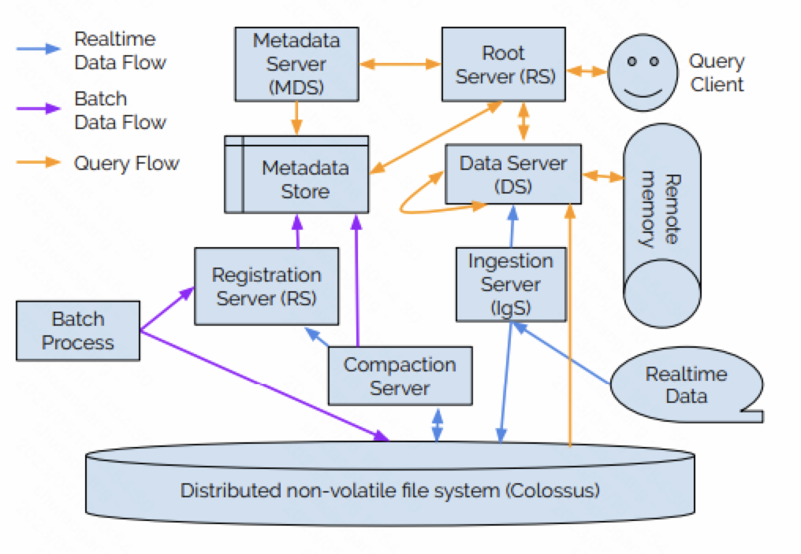

Procella是Youtube新一代的SQL处理引擎 [1]，其能够支持批式和实时的数据导入，并为不同的分析场景提供统一和高效的数据查询服务。

Youtube内部的数据分析场景主要分为报表和大盘、内嵌统计、时序监控和Ad-hoc查询等四类。这四类查询在数据量、查询复杂度和查询吞吐上具有完全不同的特点。例如报表和大盘需要处理的数据量较大，查询更加复杂，但对数据的新鲜度的要求较低；而内嵌统计和时序监控则要求最高的数据新鲜度，其需要处理不断变化的数据，并支持每秒数百万次的查询。

在过去，这四类数据分析场景分别由不同的系统来支持，例如Adhoc分析和内部小数据的报表需求由Dremel来支持；面向外部的大数据报表由Mesa和Bigtable来支持；监控由Monarch支持；而嵌入统计由Vitess来支持。但对不同的场景使用不同的系统来支持，存在着以下的挑战

* 数据需要在不同的系统之间流转，带来了很多不必要的计算和存储资源的浪费。
* 在不同系统中也很难维护数据的一致性。
* 由于这些系统的API和语义并不完全相同，因此对于开发人员来说，使用这些不同系统的学习成本较高，开发效率也较低。

为了解决上述问题，Youtube研发了Procella，来为不同的数据分析场景提供统一的数据导入和查询服务。

## 用户接口

和数据库类似，Procella中的数据被组织成一系列的表。这些表的数据会被保存在多个文件中，其中每个文件被称为一个tablet或一个partition。Procella支持多层的分区（partitioning）和聚簇（clustering）。一般事实表会按照日期来分区，而在分区内数据会按照多个维度进行聚簇。而维度表则一般会按照维度进行划分和排序。

Procella通过标准的DDL语句来对表进行创建、删除和修改。用户可以在表的定义中指定和修改列的名称和数据类型、表的划分和排序方式、约束、和数据导入的方式。对于实时表，用户还可以指定数据的降采样（down-sampling）和过期方式等。而在对数据进行查询时，Procella支持几乎全部的SQL特性，包括多级连接、集合操作和嵌套查询等。

## 系统架构

### 数据存储

Procella使用Google内部的分布式文件系统Colossus来存储数据。

Procella支持多种数据存储格式。早期Procella使用Capacitor来作为主要的数据存储格式，但Capacitor主要是针对Adhoc分析场景进行设计，其能够支持高效的数据扫描，但缺少对数据索引的支持。为了更好的支持内嵌统计和监控等场景，Procella设计了Artus格式，其能够同时支持高效的数据扫描和检索。

* Artus没有使用LZW或ZSTD这样通用的压缩算法来对数据进行编码。相反的，Artus使用了一个自适应编码方式。在编码时，Arthus会扫描数据多遍。在第一遍时，会采集数据的一些信息，包括数据的基数、最大值、最小值和排列顺序等。之后Artus会利用这些信息来选择数据的最优编码方式。Artus相比于ZSTD这类通用算法能够获得高达2倍的压缩率。
* Artus对嵌套和重复的字段类型也是用了新的编码方式来提高检索效率。
* 另外，Artus的一个最大的优点是，其可以在不解压数据的情况下执行按主键检索等很多操作。这可以显著的减少在数据查询时的IO开销，提高执行效率。

非常遗憾的是，Procella的论文并没有给出Artus的实现细节。

### 元数据存储

Procella使用BigTable和Spanner来存储表字段信息等元数据信息。

除了表的字段信息，元数据信息还包括了一些用户提高查询效率的统计信息和辅助结构，如数据分区的zonemap，bitmap，倒排索引和bloom filter等。这些元数据一些是在导入或者维护过程中从数据文件的头部中抽取出来的。

### 计算节点

Procella中包含了多种不同角色的计算节点，包括

* Root Server（RS）：根节点，用来接收用户查询，对用户查询进行解析，使用MDS提供的元数据信息来对用户查询进行优化，并负责用户查询的调度和执行。
* Metadata Server（MDS）：元数据节点，用于支持元数据的查询。
* Data Server（DS）：负责执行数据的检索和查询。每个DS会负责一部分数据；而为了提高可靠性，任意一份数据都可能由多个DS提供服务。
* Ingestion Server：负责将用户实时导入的数据写入到Procella中。
* Compaction Server：负责将导入的数据进行整理合并，形成更适合于查询的文件。
* Registration Server：负责对系统中新生成的文件进行校验和登记。这些文件可能是批式导入的文件，也可能是Compaction生成的文件。

所有这些计算节点都运行在Google内部的资源管理系统Borg上。

## 数据导入

数据的导入分为离线导入和实时导入两种方式。

### 离线导入

在离线导入时，用户只需要将需要导入的文件通过RegistrationServer登记到系统中即可。RegistrationServer会对文件的字段信息等进行校验，并将文件的元数据信息（如bloom filter）读取并写入到元数据存储中。

在导入过程中，Procella会尽量扫描文件中的数据。RegistrationServer只会读取文件的头来读取必要的元数据信息。但如果用户导入的文件中缺少必要的元数据信息，那么Procella会使用DS来扫描文件并生成所需的元数据信息。

### 实时导入

在实时导入时，用户首先通过RPC或者PubSub接口将数据交给IngestionServer。

IngestionServer在收到数据之后，会将数据按照写入的表的格式进行转换，并将数据追加写到Colossus上的一个WAL日志中。这些WAL日志文件在之后会被compact成更利于查询的列存格式。

除此之外，IngestionServer还会通过双写将转换后的数据立即发送到对应的DataServer上。这些数据会被临时保存在DataServer的内存中，并立即可以对外提供查询。在正常的流程中，DataServer需要在执行查询时才会从Colossus中读取查询所需的数据。通过将新数据写入Colossus的同时就立即推送到DataServer上，Procella可以显著的提高新数据的时效性，降低查询延迟。这对于嵌入统计和监控等场景来说，是尤为关键的。

但这个时效性的提升可能会导致数据的不一致。假设用户先从DataServer的内存中查询到了新写入的数据。当DataServer出现故障丢失了内存中的这些数据，如果Colossus的写入还没有完成的话，那么用户在第二次查询时就无法访问到这些丢失的数据，产生和第一次查询时不一致的结果。为了缓解这个问题，Procella会将DataServer内存中缓存的新数据定期备份到Colossus上。这样在DataServer从故障中恢复时，丢失的新数据是有限的。但由于这个备份并不是实时的，因此备份只可以减少丢失的数据量，而无法根本避免一致性问题。如果用户对一致性要求比较高，那么就需要新数据的即时推送，要求DataServer在查询时只可以访问Colossus上已经持久化的数据。

*写入WAL日志文件的数据何时可以被查询，在论文中没有介绍。这些数据可能在写入文件之后、文件关闭之后或者文件compact成列存格式之后这三种不同的情况下可以被查询。个人感觉，这些文件的数据在Compact完成之后才可以被查询。*

## 数据维护

CompactionServer会定期的对实时导入产生的WAL日志文件进行compact，生成更利于查询的列存格式的文件。在compact过程中，CompactionServer也可以执行用户自定义的合并逻辑，来对数据进行过滤或者聚合。

## 数据查询

用户将SQL发送到RootServer来进行数据查询。RS会对SQL进解析、重写和优化，来生成执行计划。之后RS会根据数据的划分将执行计划进行拆分成物理的执行任务，将这些任务发送到对应的DS上，由这些DS来执行。当这些DS执行完成之后，由RS将最终的结果返回给用户。

在执行过程中，DS之间通过Stubby来进行shuffle。此外，如果执行计划使用Lookup的方式来进行连接，那么一个DS还可能通过RPC来访问另一个DS来按照主键检索数据。

### 查询优化

Procella使用了动态查询优化技术来对查询进行优化。在编译阶段，优化器只会使用一个基于规则的优化器来执行一些较为明确的优化，例如谓词下推，子查询解关联等。在运行阶段，Procella会在执行过程中收集上一阶段结果的统计信息，并根据这些信息来对执行计划进行优化和调整。

为了收集运行时的统计信息，Procella当前会在每个shuffle操作之前添加一个额外的collection sites算子。由于shuffle时会对所有的数据进行遍历，collection sites算子正好可以在此时收集必要的统计信息。

基于这些收集的统计信息，Procella可以对聚合，连接和排序等算子的执行计划进行调整和优化。例如对于连接算子，Procella可以选择不同的连接方式，如广播连接，还是hash连接。

### 任务执行

Procella的查询执行引擎，称为Superluminal，可以认为是Google之前开源的向量化引擎Supersonic的升级版。

现在很多的OLAP引擎会通过LLVM将执行计划编译成本地代码，从而提高查询的执行性能。但这些本地代码的编译本身也会带来一定的时间开销，在内嵌统计和监控这些查询吞吐很高而查询时间又很短的场景中，代码编译带来的收益就很小了。为了能够同时支持不同的数据分析场景，Superluminal使用了大量的C++模板来生成代码。这种方式可以认为是解释执行和本地执行的一种折中，一方面可以减少解释执行带来的虚函数开销，一方面又可以减少本地代码生成的编译开销。

Superluminal会充分使用向量化技术来提高数据并行度，并将数据块的大小进行调整来适合L1 Cache，提高代码执行时的Cache访问效率，尽量减少执行过程中产生的中间结果。

由于Artus格式可以在不解压数据的情况下执行很多数据操作，Superluminal会将过滤和聚合等数据操作尽量下推到Artus中执行，进一步提高数据访问效率。

### 任务调度

在查询执行过程中，Procella也会出现长尾问题导致查询延迟变高。为了避免长尾问题，RS会监控DS执行请求的响应时间。如果一个请求的响应时间比中位数要高，那么RS会额外发送这个请求到其他DS上。

此外，RS会为每个请求附上不同的优先级。一般来说，更小的查询的优化级会更高。而DS会为不同优先级的请求维护不同的线程池。这样，更小的查询能够得到更快的响应；系统不会由于执行线程被大查询打满而导致系统整体的查询延迟和吞吐下降。

## 小结

Procella的一个亮点在于导入阶段支持流批一体的导入，这对于构建一个Single Source of Truth的数据湖是尤为关键的。Procella在论文中提到了它可以支持物化视图，但也没有详细介绍物化视图是如何更新维护的。

Procella的另一个亮点是对于不同数据分析场景的支持。特别的，Procella花费了很多精力来支持内嵌统计和监控这类查询吞吐高，数据延迟和查询延迟低的查询场景。比如Procella增加了IngestionServer到DataServer的旁路来降低新数据的延迟，使用代码模板而非本地代码来避免编译开销等等。

Procella中使用Artus格式来存储数据，可以支持在压缩数据上直接进行数据的过滤和检索，也是一个非常有意思的工作。但这部分在论文中没有介绍具体的实现细节，比较遗憾。

另外，Procella的论文中没有对可靠性的细节进行详细的介绍。Procella依赖Borg来对计算节点进行资源管理，但论文中没有介绍在扩缩容过程中，DS之间的数据划分和备份是如何动态调整的。

## 参考文献

[1] B Chattopadhyay et al. Procella: unifying serving and analytical data at Youtube. In VLDB 2020, vol. 12(12), pp. 2022-2034.