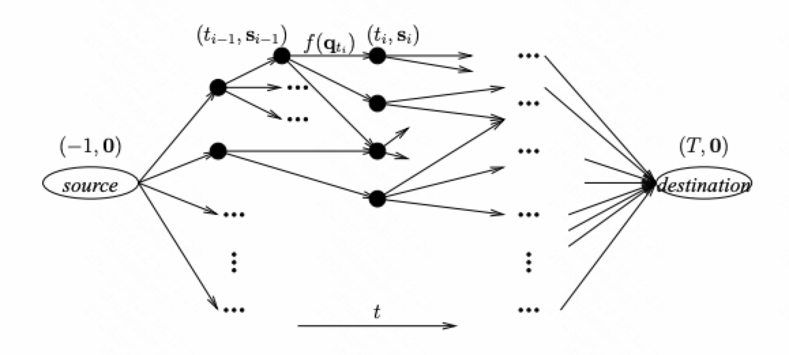

之前的物化视图维护中，我们一般不会区别对待不同表的更新。但 [1] 注意到，不同表的更新会导致不同的物化视图维护开销，因此应该对这些更新使用不同的调度策略来使得整体的维护开销最低。对于维护开销和输入数据量成线性关系的更新，我们可以尽可能地实时维护来降低在查询时的延迟；而对在维护时需要扫描全表的这类更新，我们则在保障查询延迟的前提下尽可能地推迟视图的维护。[1] 对视图维护中不同输入更新的调度策略进行研究，提出了两个有效的算法。

## 问题定义

设$V$是一个定义在基础表$R_1, ..., R_n$上的一个物化视图。我们假设时间是离散的。在时间区间$[0, T]$上的任一时刻$t$，每个基础表都有任意数目的更新到达。我们使用一个$n$维的数组$\mathbf{d}_t$表示在时刻$t$到达的更新数目，其中$\mathbf{d}_t[i]$表示表$R_i$在时刻$t$到达的更新。

在任意时刻，我们可以将每个基础表中的部分或者全部更新应用到物化视图中。我们使用$\mathbf{s}_t$来记录在时刻$t$每个基础表还未应用到物化视图中的更新数目，使用$\mathbf{p}_t$表示在时刻$t$应用到物化视图中的更新数目。在每个时刻，我们会应用一部分更新，同时也会有新的更新到达，因此$\mathbf{s}\_{t+1} = \mathbf{s}_t - \mathbf{p}_t + \mathbf{d}\_{t+1}$。

我们假设维护视图的开销只和更新的表以及更新的数目相关。来自表$R_i$的$k$个更新应用到视图$V$的开销可以通过函数$f_i(k)$​来表示。对于不同表的更新，维护视图的开销函数可能是不同的。*来自同一个表的不同更新在维护视图时的开销可能也是不同，但在本文中暂时不会考虑。*

我们假设对于视图维护开销函数$f_i: \mathbb{Z}^+ \to \mathbb{R}$满足以下两个条件

* **单调性（Monotonicity）**：对任意的$x \ge y \ge 0$，有$f_i(x) \ge f_i(y)$ 
* **次可加性（Subadditivity）**：$f_i(0) = 0$，并且对于任意的$x \ge 0$和$y \ge 0$，有$f_i(x+y) \le f_i(x) + f_i(y)$

在查询视图时，我们需要将未应用到视图的更新也反映到查询结果中。我们假设在查询时反映更新的开销和维护视图的开销是一致的，也通过$f = \{f_1, ..., f_n\}$来表示。在时刻$t$，系统中未应用到视图的更新为$\mathbf{s}_t - \mathbf{p}_t$，此时的查询延迟可以通过$f(\mathbf{s}_t - \mathbf{p}_t)$表示。

序列$\mathcal{P} = \mathbf{p}_0, ..., \mathbf{p}_T$就构成了一个在时间区间$[0, T]$上的**视图维护计划**。满足以下条件的视图维护计被称为是一个**有效的的视图维护计划**。

* 视图在时刻$T$是完全更新的，即$\mathbf{s}_T = \mathbf{0}$
* 在任意时刻，我们选择更新每个表部分或者全部的剩余更新，即$\forall i \in [1, n], 0 \le \mathbf{p}_t[i] \le \mathbf{s}_t[i]$
* 在任意时刻，查询开销不超过给定的阈值$C$，即$f(\mathbf{s}_t - \mathbf{p}_t) \le C$

我们目标是寻找开销最低的一个有效视图维护计划，即在满足查询开销限制的前提下，使得下式最小：

$$f(\mathcal{P}) = \sum\_{i = 0}^T f(\mathbf{p}_t) = \sum\_{t = 0}^T \sum\_{i = 1}^n f_i(\mathbf{p}_t[i])$$

## 延迟维护计划

如果$f(\mathbf{s}_t) > C$，我们称系统状态$\mathbf{s}_t$已经**溢出**了。此时如果我们不采取任何维护动作（即$\mathbf{p}_t = \mathbf{0}$），那么此时的查询开销就会超过给定的阈值。在系统状态$\mathbf{s}_t$溢出时采取的维护动作被称为是**延迟**的维护动作。如果维护计划$\mathcal{P}$中每个维护动作都是延迟的，那么$\mathcal{P}$被称为延迟的维护计划，即对所有的$t \in [0, T]$，$\mathbf{p}_t$要么为$\mathbf{0}$，要么是延迟的。

给定任意一个有效的维护计划，`MakeLazyPlan`算法可以用于构造一个有效的延迟维护计划。



// Input: $\mathbf{p_0}, ..., \mathbf{p}_T$

// Output: $\mathbf{q}_0, ..., \mathbf{q}_T$

$\mathbf{q} \gets \mathbf{0}$

for $t = 0$ to $T$ 

​    $\mathbf{q} \gets \mathbf{q} + \mathbf{p}_t$

​    if $f(\mathbf{s}_t^\mathbf{Q}) > C$ or $t = T$ then 

​        $\mathbf{q}_t \gets \mathbf{q}$

​        $\mathbf{q} \gets \mathbf{0}$

​    else

​        $\mathbf{q}_t \gets \mathbf{0}$

​    end if 

return $\mathbf{q}_0, ..., \mathbf{q}_T$



**定理1.** 对于任意一个有效的维护计划$\mathcal{P}$，都存在一个有效的延迟维护计划$\mathcal{Q}$，使得$f(\mathcal{Q}) \le f(\mathcal{P})$。

**证明.** 给定一个维护计划$\mathcal{P} = \{\mathbf{p}_0, ..., \mathbf{p}_T \}$，我们使用`MakeLazyPlan`算法来构造一个延迟维护计划$\mathcal{Q}$。由于$\mathcal{Q}$中每个非零的维护动作$\mathbf{q}_t$都是由一个或多个$\mathcal{P}$中的维护动作合并而成，根据我们对成本函数次可加性的假设，我们可以得到$f(\mathcal{Q}) \le f(\mathcal{P})$。

## 最小贪心的延迟维护计划

根据上面这个定义，最优的维护计划一定是延迟的。这可以帮助我们减小问题的搜索空间。但这个空间仍然很大。论文进一步将搜索空间缩小到了LGM维护计划。

一个延迟的维护计划$\mathcal{P} = \mathbf{p}_0, ..., \mathbf{p}_T$被称为是最小贪心的延迟维护计划（或LGM维护计划），如果其满足以下两个条件

* **贪心性**：$\mathcal{P}$中的每个维护动作都是贪心的，即对每个表要么处理其当前所有的更新，要么完全不处理。也就是，对所有的$t \in [0, T]$和$i \in [1, n]$，有$\mathbf{p}_t[i] = \mathbf{s}_t[i]$或$\mathbf{p}_t[i] = 0$。
* **最小性**：除了$\mathbf{p}_T$之外，其他的维护动作$\mathbf{p}_t$都是最小的，即没法将一个$\mathbf{p}_t$的非空成员设置为0之后使得$f(\mathbf{s}_t - \mathbf{p}_t) \le C$仍然成立。

给定一个有效的维护计划$\mathcal{P}$，下面这个算法可以构造一个有效的LGM维护计划。其中，我们使用$\mathbf{s}^\mathcal{P}_t$表示在维护计划$\mathcal{P}$下时刻$t$的系统状态；给定$\mathbf{q}'$，算法`MinimizePlan`通过将$\mathbf{q}'$中的一个或多个非空成员设置为0返回一个满足$f(\mathbf{s} - \mathbf{q}) \le C$的最小维护计划$\mathbf{q}$。



// Input: $\mathbf{p_0}, ..., \mathbf{p}_T$

// Output: $\mathbf{q}_0, ..., \mathbf{q}_T$

for $t = 0$ to $T - 1$ 

​    if $f(\mathbf{s}_t^\mathcal{Q}) > C$ then

​        for $i = 1$ to $n$ do 

​            if $\mathbf{s}_t^\mathcal{Q}[i] > \mathbf{s}_t^\mathcal{P}[i] - \mathbf{p}_t^\mathcal{P}[i]$ then

​                $\mathbf{q}_t'[i] \gets \mathbf{s}_t^\mathcal{Q}[i]$

​            else 

​                $\mathbf{q}_t'[i] \gets 0$

​            end if

​        $\mathbf{q}_t \gets \text{MinimizePlan}(\mathbf{q}_t')$

​    else 

​        $\mathbf{q}_t \gets \mathbf{0}$

​    end if

$\mathbf{q}_T \gets \mathbf{s}^\mathcal{Q}_{T-1}$

return $\mathbf{q}_0, ..., \mathbf{q}_T$



通过贪心性和最小性可以极大的减少我们的搜索范围，但也会导致更差的维护计划（更高的维护开销）。但下面这个定理证明，`MakeLGMPlan`算法导致的维护开销增加是有限的。

**定理2.** 对于任意给定的一个有效的维护计划$\mathcal{P}$，$\mathcal{Q}$是对$\mathcal{P}$通过`MakeLGMPlan`生成的LGM维护计划，有

$$ f(\mathcal{Q}) \le 2 \cdot f(\mathcal{P}) $$

**证明.** 见 [1]。

## 搜索最小贪心的延迟维护计划

[1] 提出了两种用于搜索LGM维护计划的算法，第一个基于A*算法；第二个则是一个在线启发算法。

### A*算法

为了能够应用A*算法，我们首先将搜索空间映射为一张图$G$。在这个图中，每个节点都表示采取维护动作之后一个可能的系统状态。如果在一个有效的LGM维护计划中，可以从系统状态$\mathbf{s}_t'$变为$\mathbf{s}'\_{t+1}$，我们就可以在这两个系统状态对应的顶点之间添加一条有向边。此外，$G$有一个在时刻-1的源点，表示系统还没有任何更新到达的初始状态；一个在时刻$T$的汇点，表示所有更新都已经反映到视图中的终止状态。

之后，我们可以利用A*搜索算法来搜索一个从源点到汇点的最优路径。我们使用评估函数$d(x) = g(x) + h(x)$来扩展搜索路径，其中$g(x)$表示从源点到节点$x$的最小路径开销；$h(x)$是从节点$x$到终点的开销估计。

我们使用下面启发式算法来对$h(x)$进行计算

$$h(x) = \sum_{i = 1}^n \left \lfloor \frac{\mathbf{s}[i] + K_i}{m_i + B_i} \right \rfloor f_i(b_i)$$

其中

* $B_i = \max \\{ b | f_i(b) \le C \\}$是在满足查询开销约束下能够处理的最大更新数目
* $m_i$是表$R_i$在任一时刻能够到达的最大更新数目
* $K_i$是表$R_i$在时间区间$(t, T]$到达的最大更新数目

可以证明，$h(x)$是可采纳的（admissible）和一致的（consistent）。根据A*算法的最优性条件可以知道，我们最终找到的路径就是全局最优的路径。注意，所以这里找到的全局最优路径是在$h(x)$下的最优路径。由于$h(x)$对维护开销的估计和实际并不一致，我们得到的而非实际上的最优维护方案。

### 启发算法

[1] 还提出了一个在线启发的算法，用于在无法获知更新到达分布的情况下提供维护计划。

假设在时刻$t$，系统状态$\mathbf{s}_t$溢出了，即$f(\mathbf{s}_t) > C$。此时我们需要采取维护动作来保障查询开销的限制。我们选择一个最小贪心的维护动作$\mathbf{q}_t$使得下式的值最小

$$H(\mathbf{q}_t) = \frac{F_t + f(\mathbf{q}_t)}{t + \text{TimeToFull}(\mathbf{s}_t - \mathbf{q}_t)}$$

其中

* $F_t$为当前维护计划已经花费的维护开销，即$F_t = \sum\_{i = 0}^{t-1} f(\mathbf{p}_i)$。
* $\text{TimeToFull}(\mathbf{s})$用来预测后续的更新使得系统状态溢出所需的时间。这个预测可以在运行时动态的进行维护。

## 小结

这篇文章是第一个将物化视图维护的调度拓展到数据维度上的工作。这个文章还发现了最优的维护计划一定是延迟的，这个可以很好的帮助减少搜索空间。文章将搜索空间进一步缩小到了最小贪心的延迟计划，并用搜索和启发式算法给出了近似求解的方案。

但这个文章在设计求解算法的时候，没有考虑成本开销。根据直观的感受，如果应用某个表的更新代价很低，那么我们应该可以以更高的频率去应用这个表的更新。这个规则应该可以在搜索和启发过程中提供一些帮助。

## 参考文献

[1] H. He et al. Asymmetric batch incremental view maintenance. In ICDE 2005, pp. 106-117.