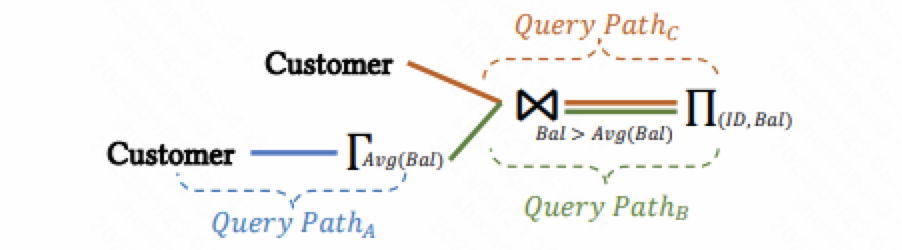

[1] 是另一篇关于物化视图维护的维护计划的研究工作。但和之前的工作 [[2]](../hxy05) 不同的是，[1] 没有考虑对不同的输入采取不同的维护计划，而是对一个视图中的不同算子使用不同的维护计划。[1] 分析了不同算子的增量计算能力，使用动态规划给出了一个视图维护的维护计划。

## 问题定义

物化视图可以通过一个查询语法树来表示。在这个查询语法树中，我们有多个查询路径（query path），每个查询路径由输入、输出和一系列算子组成。下图就是一个具有多个查询路径的视图的示例。

在查询路径上，会有一些堵塞算子（blocking operators），如排序、聚合和distinct等。每个堵塞算子都有一个输出缓存，将自己的计算结果保存在这个缓存中。当缓存中的数据到达一定阈值时，下游的算子就会被调度执行来清空缓存中的数据。

每个算子可以使用不同的调度频率来情况输出缓存。为了简化设定，论文按照输入数据量占全部数据量的比例来清空缓存。当调度频率为$k$时，算子在收到全部数据量的$1/k$时被调度执行，并清空其对应的缓存。$k$越大，则意味着算子有更高的调度频率；而当$k=1$时，则意味着算子只有在输入完全到达时才会被执行。

如果一个物化视图的查询树中存在$Q$个查询路径，那么这个物化视图的维护计划可以用这$Q$个查询路径的缓存清空策略来表示。我们使用数组$P = (P_1, P_2, ..., P_Q)$表示物化视图的维护计划，其中$P_i$表示第$i$个查询路径的缓存清空策略。注意到，每个算子的调度频率不可能高于输入算子的调度频率，因此对所有的$j \in \text{children}(i)$, $P_i \le P_j$，其中$\text{children}(i)$返回在查询路径中算子$i$的所有下游算子。

对于一个维护计划$P$，我们使用$\mathcal{C}_F(P)$表示在最终查询时需要花费的开销，$\mathcal{C}_T(P)$表示维护和查询的花销。通过更加频繁的维护，我们可以减少最终查询时的开销，但也会增加系统整体的开销。我们希望在满足查询开销在一定阈值的情况下，尽可能减少整体的开销。因此我们的问题可以抽象为
$$
\begin{aligned}
& \text{minimize} &\mathcal{C}_T(P) \\\\
& \text{subject to} &\mathcal{C}_F(P) \le L \times \mathcal{C}_F(\bar{P})
\end{aligned}
$$
其中$\bar{P}=(1, 1, ..., 1)$，表示视图按照完全批式的方式计算，即所有的算子都只在上游的数据完全到达之后才开始进行计算；$L$是一个设定的阈值。

## 计算增量收益

对任意两个维护计划$P_1$和$P_2$，如果$P_2$中所有查询路径的调度频率都不小于$P_1$中对应查询路径的调度频率，我们则称$P_2 \ge P_1$。

如果一个维护计划能够通过更高的调度频率减少更多的查询开销，那么我们就认为这个维护计划具有更好的增量计算能力。给定两个维护计划$P_1$和$P_2$，$P_2 > P_1$，我们通过下面这个公式来计算$P_2$相比于$P_1$通过增量计算获得的收益：

$$Inc(P_1, P_2) = \frac{\mathcal{C}_F(P_1) - \mathcal{C}_F(P_2)}{\mathcal{C}_T(P_2) - \mathcal{C}_T(P_1)}$$

基于上面的公式，我们进一步可以用$Inc(P) = Inc(P, \bar{P})$得到任意一个维护计划$P$的增量收益。如果$Inc(P) = \infty$，则意味着这个视图可以充分的通过增量计算进行维护，每当更新到达时就立即对视图进行维护，从而在查询不需要再花费任何的开销；而如果$Inc(P) = 0$，那么这个视图无法通过提前的增量计算减少最终查询的开销，我们只需要在必要的时候对视图进行维护即可。

## 寻找维护计划

论文设计了一个贪心算法来利用增量收益减少搜索空间。



$P \gets \bar{P}$

while true do

​    $i \gets \text{argmax}\_{i: P_i < P_j, \forall j \in \text{children}(i)} \partial_i(P)$

​    if $\partial_i (P) \le 0$ then

​        return P

​    end if 

​    $P[i] \gets P[i] + 1$

​    if $\mathcal{C}_F(P) \le L \times \mathcal{C}_F(\bar{P})$ then

​        return $P$

​    end if

end while



我们从完全批量计算的维护计划$\bar{P}$开始，依次增加查询路径的调度频率。在每次调整时，我们遍历所有的查询路径，寻找能够带来最大增量收益的查询路径，并将其对应的调度频率加一。当维护计划可以满足查询开销的约束时，我们就立即返回。

## 小结

这个工作提供物化视图的维护调度中另一个维度的视角，考虑对数据链路上的不同算子采取不同调度来优化整体的维护开销。这个论文花费了较大的精力来对维护计划的开销进行评估，包括考虑不同更新类型的基数估计等。但在最终维护计划的搜索上，论文使用了一个简单的贪心算法。由于论文选择从最差的计划开始贪心，所以感觉这个贪心算法很难有机会得到一个最优的维护计划。

## 参考文献

[1] D. Tang et al. Thrifty query execution via incrementability. In SIGMOD 2020, pp. 1241-1256.

[2] H. He et al. Asymmetric batch incremental view maintenance. In ICDE 2005, pp. 106-117.